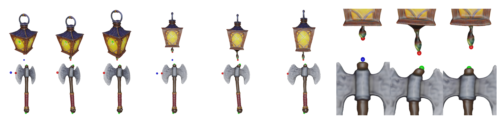

# As-Plausible-As-Possible (APAP)


[Project Page](https://as-plausible-as-possible.github.io) | [Paper](https://as-plausible-as-possible.github.io/static/APAP.pdf) | [arXiv](https://arxiv.org/abs/2311.16739)

[Seungwoo Yoo*](https://dvelopery0115.github.io)<sup>1</sup>, [Kunho Kim*](https://soulmates2.github.io)<sup>1</sup>, [Vladimir G. Kim](http://www.vovakim.com)<sup>2</sup>, [Minhyuk Sung](https://mhsung.github.io)<sup>1</sup> (* co-first authors)

<sup>1</sup>[KAIST](https://www.kaist.ac.kr/en/), <sup>2</sup>[Adobe Research](https://research.adobe.com)

This is the reference implementation of **As-Plausible-As-Possible: Plausibility-Aware Mesh Deformation Using 2D Diffusion Priors (CVPR 2024)**.

## Get Started

Clone the repository and create a Python environment:
```
git clone https://github.com/KAIST-Visual-AI-Group/APAP
cd APAP
conda create --name apap python=3.9
conda install pytorch==2.0.1 torchvision==0.15.2 torchaudio==2.0.2 pytorch-cuda=11.7 -c pytorch -c nvidia
conda install pytorch-sparse -c pyg
pip install wandb
pip install diffusers==0.19.0
pip install accelerate transformers ninja
pip install cholespy libigl
pip install imageio[ffmpeg] jaxtyping tyro
pip install fpsample trimesh pymeshlab pyrender
```

You also need to follow the instructions in the following repositories to install dependencies:
- [nvdiffrast](https://github.com/NVlabs/nvdiffrast)
- [Semantic-SAM](https://github.com/UX-Decoder/Semantic-SAM)

We provide data necessary to run our codes via [Google Drive](https://drive.google.com/drive/folders/12IRLEbH8tlMzmsc3Ovhvz0xscr1IKi6C?usp=sharing). Specifically, you can download
- [APAP-Bench 2D](https://drive.google.com/file/d/10aBwtTT3DactcP_epEYfeQKT23Wyt0xb/view?usp=share_link)
- [APAP-Bench 3D](https://drive.google.com/file/d/1_9DPkAAqokRUiYeppmgo9fOH07pxkGs7/view?usp=share_link)
- [LoRA checkpoints](https://drive.google.com/file/d/1F-Obg55a8NvWHQQagZi3AqJZAE-GpRDD/view?usp=share_link)

Download the files from the link and place them under the directory `data`. After that, the directory structure should look like:
```
APAP
├── data
│   ├── apap_2d  # APAP-Bench 2D
│   ├── apap_3d  # APAP-Bench 3D
│   ├── lora_ckpts  # LoRA checkpoint files
│   ├── pretrained_models  # Additional pretrained models (e.g., SAM)
│   └── ...
├── ext
├── scripts
├── src
├── environment.yaml
└── README.md
````

## Making Deformations using APAP-Bench

To run 3D mesh deformation experiments using *APAP-Bench (3D)*, run:
```
python scripts/exp/batch/batch_deform_meshes.py \
--data-list-path configs/deform_meshes/data/apap_3d.txt
--out-root outputs/apap-3d
--gpu-ids 0
```
Note that the experiments can be parallelized by specifying multiple GPU IDs via the argument `--gpu-ids`.

Similarly, 2D mesh deformation experiments using *APAP-Bench (2D)* can be done by running:
```
python scripts/exp/batch/batch_deform_meshes.py \
--data-list-path configs/deform_meshes/data/apap_2d-all.txt
--out-root outputs/apap-2d
--gpu-ids 0
```

## Fine-tuning Stable Diffusion using LoRA

We directly adapt [Dreambooth training script](https://github.com/huggingface/diffusers/blob/v0.19.0-release/examples/dreambooth/train_dreambooth_lora.py) from [diffusers](https://github.com/huggingface/diffusers) without modification.
For convenience, we provide a batch script that allows users to train multiple LoRAs in parallel. To run the script, simply execute:
```
python scripts/lora/batch_train_dreambooth_lora.py \
--data-list-path configs/lora_train/apap_3d.txt \
--exp-group-name apap-3d-lora \
--out-root outputs/lora_ckpts/apap-3d \
--gpu-ids 0
```
This will produce LoRA checkpoints, each fine-tuned to the renderings of meshes in APAP-Bench (3D).
Note that each row of a training config file consists of two items - `object_name` and `data_dir`. The `object_name` is used to automatically populate a text prompt used during fine-tuning and the `data_dir` is a directory containing images for fine-tuning.  
After training, the outputs are arranged into a directory structure as follows:
```
{out-root}
├── object_name1
│   ├── 0000  # Identifier for image dataset 
│   └── ...
├── object_name2
│   ├── 0000  # Identifier for image dataset 
│   └── ...
├── object_name3
│   ├── 0000  # Identifier for image dataset 
│   └── ...
└── ...
```
The checkpoint directories can be passed to the script `deform_meshes.py` via the command-line argument `--lora-dir`.

## Citation
Please consider citing our work if you find this codebase useful:
```
@inproceedings{yoo2024apap,
  title = {{As-Plausible-As-Possible: Plausibility-Aware Mesh Deformation Using 2D Diffusion Priors}},
  author = {Yoo*, Seungwoo and Kim*, Kunho and Kim, Vladimir G. and Sung, Minhyuk},
  booktitle = {CVPR},
  year = {2024},
}
```
